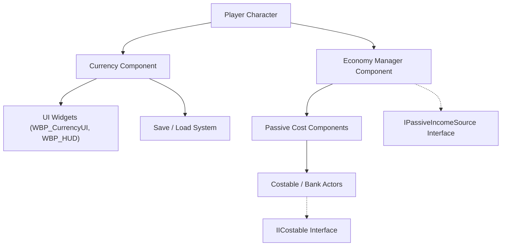

# Modular Currency System  

  
  

---

## 💰 Overview  

**Modular Currency System** is an **individual Unreal Engine III project** developed by **Mahan Poor Hamidian** to build a **universal, reusable in-game economy framework**.  
It supports **multiple currencies**, **UI feedback**, **passive income**, and **persistent saving/loading**, all structured for modular integration across different projects.  

Built entirely in **C++ and Blueprints**, the system demonstrates mastery of **interfaces**, **delegates**, and **component-based design** in Unreal Engine.

---

## 🧩 Core Features  

### 💵 Currency Component  
- Tracks player-owned currencies using `TMap<FGameplayTag, int32>` (`CurrencyBalances`).  
- Provides `AddCurrency()` and `ApplyTransaction()` for tagged deposits and withdrawals.  
- Uses multicast delegates to update UI widgets in real time.  
- Handles overlap-based automatic purchases via `ICostable` interface.

### 🛒 Costable Interface & Actor  
- Implements `IICostable` to define purchasable or collectible objects.  
- Holds a `CostBundle` (map of currency tags and amounts).  
- Supports “vanishable” and “emptiable” states for dynamic economy behavior.  
- Integrates a `WidgetComponent` to visualize cost in-world.

### 🏦 Passive Income System  
- Three-component modular design:
  - `UPassiveCostComponent` — defines an income/drain source.
  - `UEconomyManagerComponent` — orchestrates all passive sources and applies timed transactions.
  - `IPassiveIncomeSource` — interface for consistent income communication.  
- Each source can:
  - Deposit income **directly to the player** or **into a bank (Costable)**.  
  - Have its own **interval per currency type**.  

### 💾 Save & Load System  
- `UEconomySaveGame` stores:
  - Player currency balances.  
  - Bank states (bundle values and empty status).  
- `UEconomyManagerComponent` manages serialization through `SaveEconomy()` and `LoadEconomy()`.  

### 🧠 Modular Design  
- Fully game-agnostic and portable between projects.  
- Extensible with multipliers, upgrades, or external economy data.  

---

## 🧱 Architecture Diagram  

---

## 🧭 How to Use

### Define Currencies
Go to Project Settings → Gameplay Tags and add tags like Currency.Gold, Currency.Gem.

### Attach Components
Add CurrencyComponent and EconomyManagerComponent to your Player or Controller.

### Add Interactables
Place Costable actors for purchases or banks.  
Add PassiveCostComponent for income sources.

### Configure Behavior
Set DepositType to either player or bank.  
Optionally assign a target Bank actor.

### Run the Game
The system handles everything automatically, including saving and restoring data.

---

## 📖 Development Journal Highlights

**2025-09-12**  
Added AddCurrency() and SpendCurrency() functions.  
Implemented ICostable and overlap purchases.

**2025-09-15**  
Built UI feedback (WBP_HUD, WBP_CurrencyUI).  
Added delegate-based real-time updates.

**2025-09-16**  
Switched to CurrencyBalances map using FGameplayTag.  
Added multi-resource logic.

**2025-09-18**  
Introduced transaction bundle system for atomic multi-currency updates.

**2025-09-21 → 2025-09-29**  
Added Passive Income System and timer logic.  
Fixed interface and crash bugs.

**2025-10-03 → 2025-10-06**  
Added bank deposits and multi-currency support.  
Implemented save/load and stability fixes.

---

## 👤 Developer
**Mahan Poor Hamidian** — Developer

---

